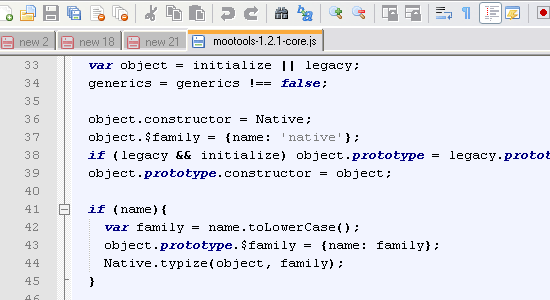
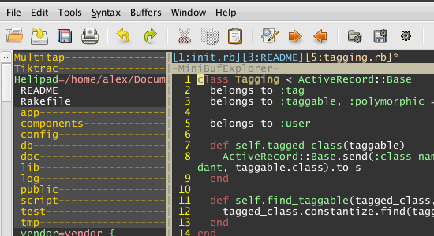
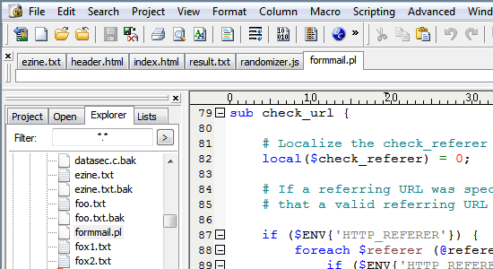

# 编辑器

作为程序员，编辑器很重要

现在比较好用的编辑器

Notepad++

一般的人电脑都有，因为这个简单，可以做的好多。

Vim

在Linux下，上面说的需要是windows下，当然windows下也有，不过一般学这个需要很多快捷键，开始是很难，学到后面，用它打的速度比很多现在的软件还快，看代码的也好，这个也是必学，学不好不怕。如果想要做Web，需要Linux那么还是要学，用到再学，基本的命令就是`esc i` 

UltraEdit

tmux:高效的全键盘开发工具

[code blocks](code blocks.md)

Visual studio

世界上最好的IDE，可以在http://visualstudio.com/ 下，安装简单，当然需要Windows系统

 