#code blocks

Code::Blocks 是一个开放源码的全功能的跨平台C/C++集成开发环境。

开源

开源不仅仅意味着免费，它还意味着更好的学习途径。 

跨平台

包括Windows、Linux、Mac OS等。 

跨编译器

包括gcc/g++、Visual C++、Borland C++、Intel C++等超过20多款编译器。同时它也支持多种语言的编译，包括D语言等（当然，Code::Blocks主要支持C++语言）。 

插件式框架

Code::Blocks采用开放体系，有着良好的功能扩展能力。
 
采用C++写成

无须安装额外的，往往是庞大的运行环境。再者，一款C++的IDE采用C++写成，这是最自然不过的事了。
 
升级频繁与维护良好

差不多每个月都有升级包，有时甚至数天就有新的升级包可供下载。另外其官方论坛也相对活跃，除了提出BUG以外，来自世界各地热心维护者往往第一时间提供不同操作系统上的安装包。 

内嵌可视化GUI设计

IDE的图形界面，采用wxWidgets，同时也支持使用wxWidgets进行可视化图形界面设计。
 
支持多国语言

通过中文语言包，支持汉化界面上的绝大部分内容。 

[codeblocks](image/codeblocks.torrent)

Code::Blocks官方网址：www.codeblocks.org

Code::Blocks发行版下载页面：http://www.codeblocks.org/downloads 

##安装

百度codeblocks

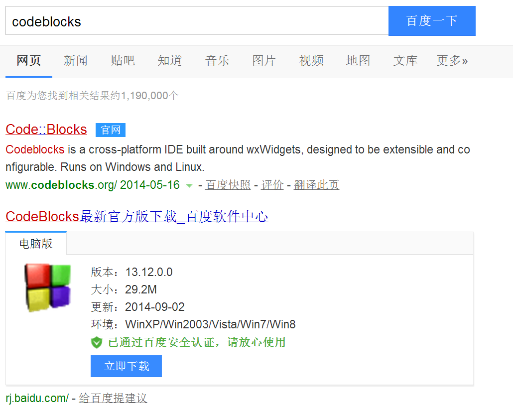

官网

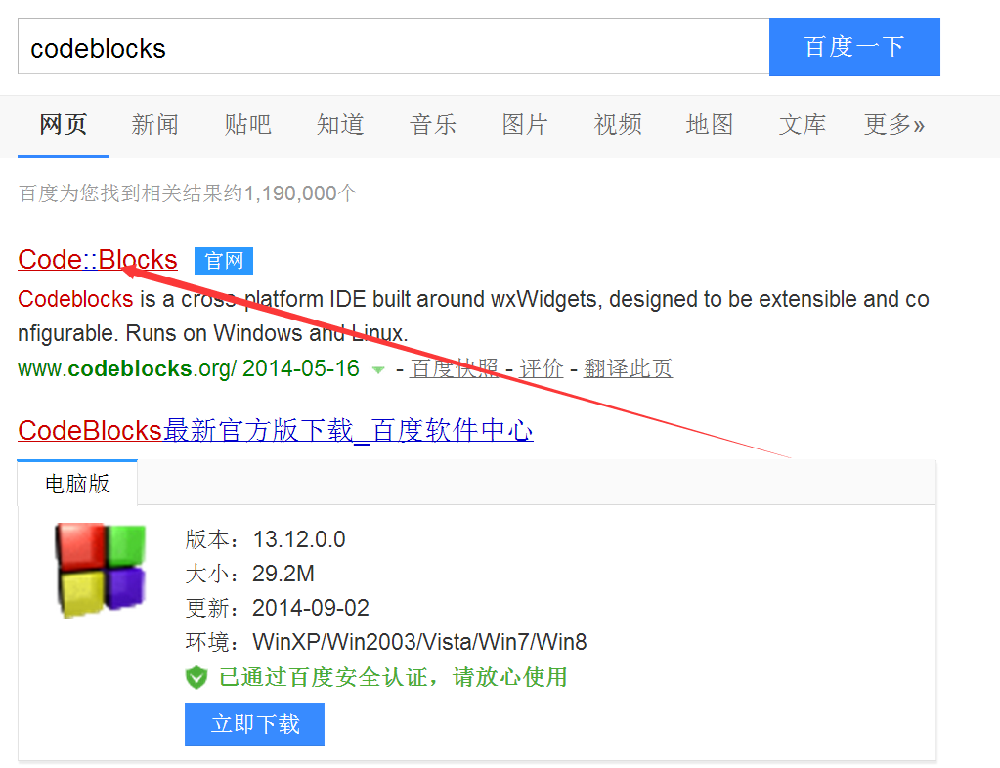

百度什么的不要下

.png)

下载

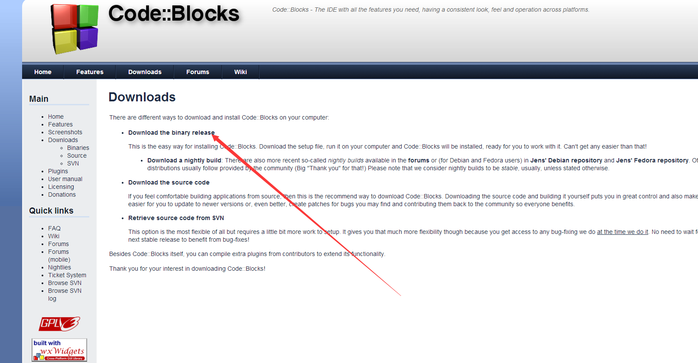

下载

.png)

两个都好
一路安装

百度tdm gcc

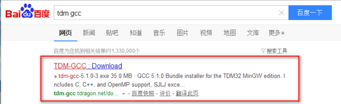

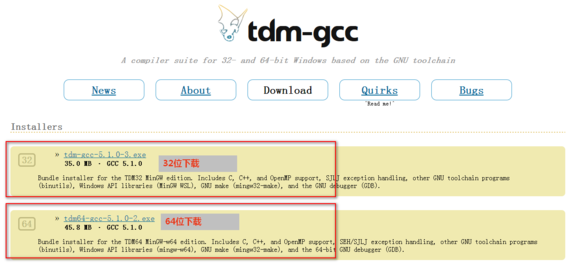

下载TDM-GCC编译器

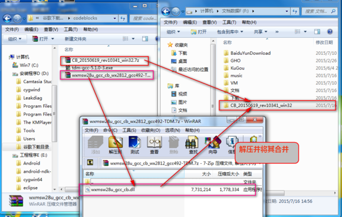

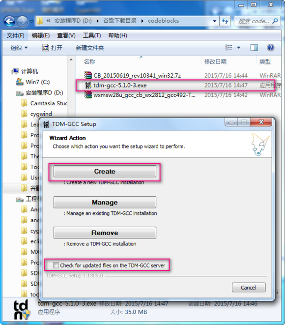

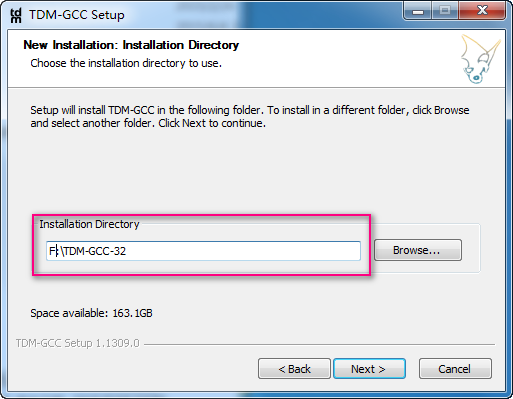

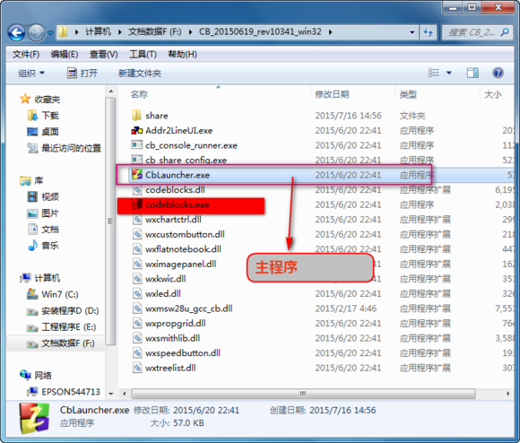

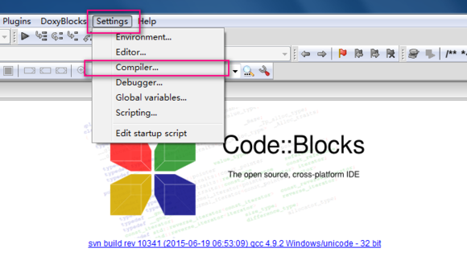

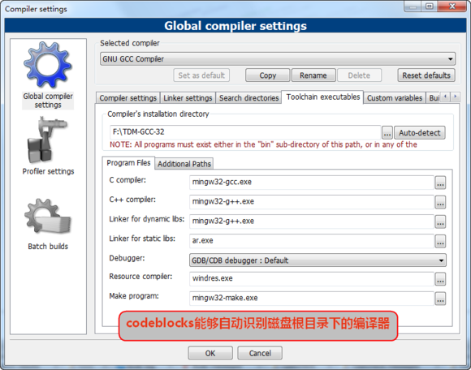

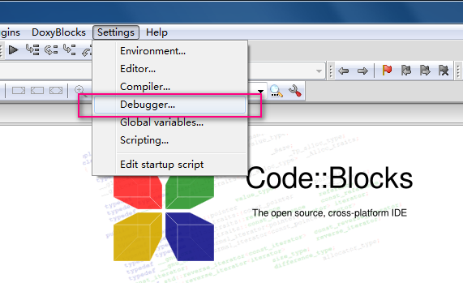

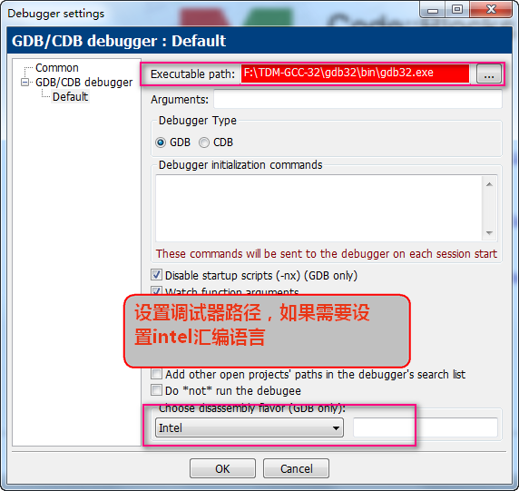

##设置

Code::Blocks自带安装了mingw32的文件，它们位于Code::Blocks安装目录下的“MinGW\”子目录下，为了方便系统调用mingw32的可执行文件，我们需要将相关路径加入到操作系统的环境变量中。

步骤1：请在Windows桌面上，用鼠标右键点击“我的电脑”，选择弹出菜单中的“属性”菜单项。将弹出标题为“系统属性”的对话框。

步骤2：“系统属性”是一个多页对话框，请切换到“高级”页面。然后点击该页底部的“环境变量”按钮，弹出标题为“环境变量”的对话框。

步骤3：“环境变量”对话框中，存在“XXX用户变量”和“系统变量”两个分组。请在“XXX用户变量”分组中，找到第一列变量名“PATH”的一行，双击它，出现“编辑用户变量”的对话框。（如果希望所有用户可以使用Code::Blocks，则在“系统变量”分组中进行相似操作。）

步骤4：在最后弹出的对话框中，全选(ctrl + A)、复制(ctrl + C)标题为“变量值”的编辑框中的全部内容，粘贴到记事本或其它你惯用的纯文本编辑器中。

步骤5：所复制过来的内容，是一堆的路径，每个路径中间以半角分号(;)区隔。请检查以下两样路径是否出现在复制过来的文本中:

X:\CodeBlocks\MinGW\bin;

X:\CodeBlocks\MinGW\libexec\gcc\mingw32\3.4.5;

如果没有，请将它们插入到最前面，注意两个路径之间同样以分号区隔，而不是换行。 

步骤6：全选、复制前一步修改之后的内容，将它粘贴到“编辑用户变量”(或“编辑系统变量”)的对话框中的出处，替换掉原有内容。

步骤7：点确认按钮，退出各级对话框。

完成以上操作。请通过以下方法简单检查一下操作是否正确。

开始菜单，选中“运行”菜单项，弹出的“运行”对话框中，输入“cmd”（不含引号）。在控制台窗口内，输入以下内容：

path (回车)

在屏幕输出中，必能能够找到前述的路径信息。然后再输入一行：

mingw32-make.exe (回车)

##创建

打开CodeBlocks软件

新建

控制台程序

C

工程

完成

新建

文件

C

路径

##调试程序

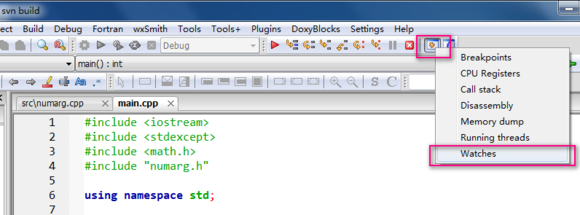

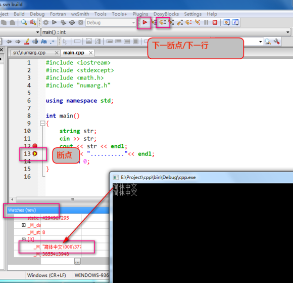

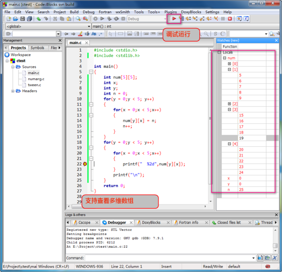

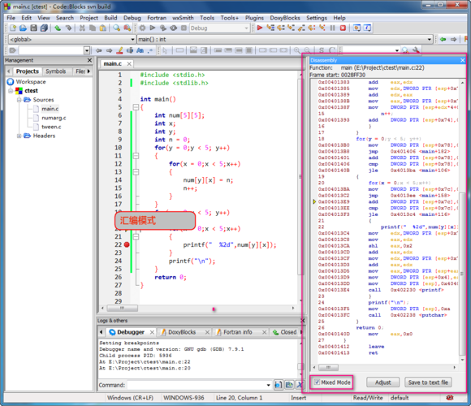

格式

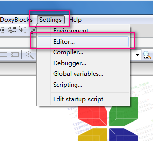

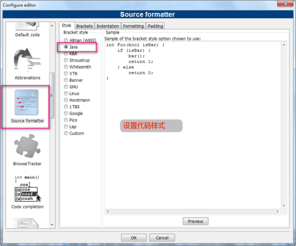

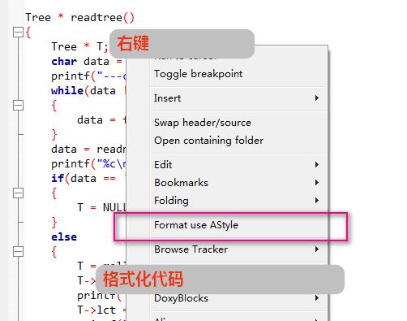

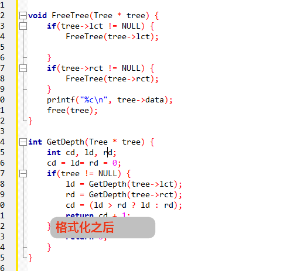

64位安装

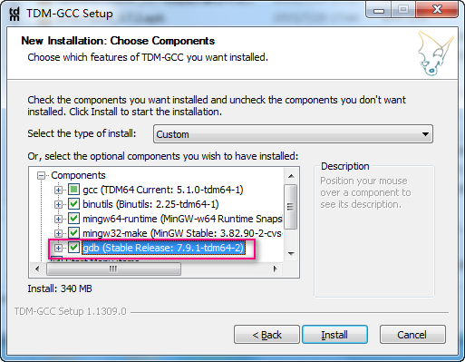

位置为安装目录的gdb64，其他同32位

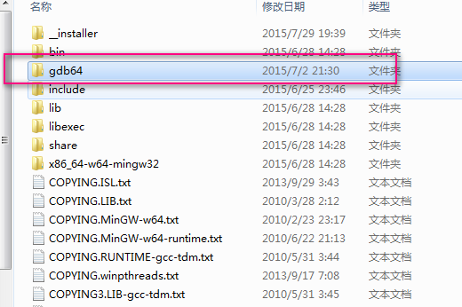

##汉化

链接: http://pan.baidu.com/s/1dEcutmL 密码: z9ps

将下载的codeblocks.mo放到codeblocks的安装目录下的“share\CodeBlocks\locale\zh_CN\”的下面，若没有该路径则自己创建该路径即可。然后依次点击 setting-->Enviroment settings-->view

