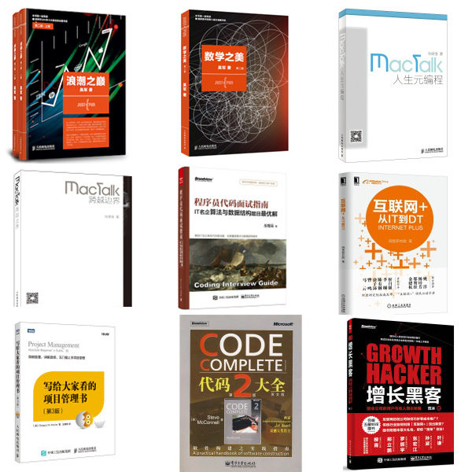
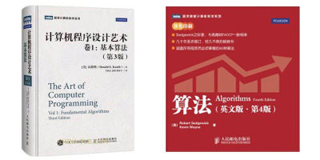
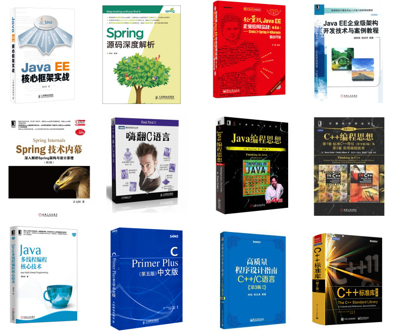
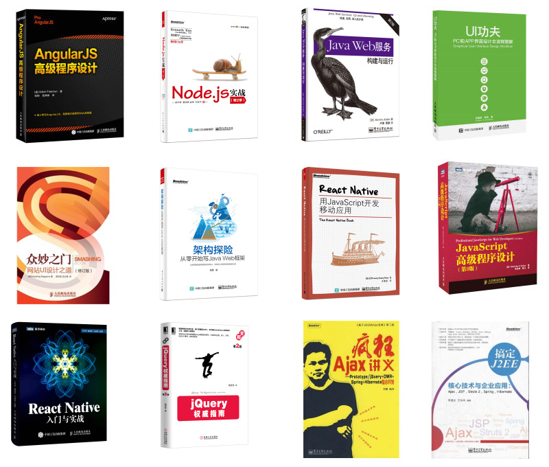

# 入门多看书

计算机科学概论(第11版).(美)布鲁克希尔.扫描版.PDF

链接：http://pan.baidu.com/s/1kUsxjN5 密码：sn2o

计算机科学导论 侯惠芳

http://yunpan.cn/cuIV7cN8I7c7Y 访问密码 1077

编程语言 百度百科.pdf

链接：http://pan.baidu.com/s/1gerjz8Z 密码：nzf5

计算机组成原理

链接：http://pan.baidu.com/s/1kU1kEij 密码：6zfq

《代码大全》 史蒂夫·迈克康奈尔

《程序员修炼之道》

《重构：改善既有代码的设计》

《Effective C++》

##经典

- [《浪潮之巅 第二版》](http://item.jd.com/11253183.html)

- [《数学之美 第二版》](http://item.jd.com/11572052.html)

- [《MacTalk•人生元编程》](http://item.jd.com/11398297.html)

- [《MacTalk 跨越边界》](http://item.jd.com/11803342.html)

- [《程序员代码面试指南》](http://item.jd.com/11770838.html)

- [《互联网 ：从IT到DT》](http://item.jd.com/11678700.html)

- [《写给大家看的项目管理书（第3版）》](http://item.jd.com/11781053.html)

- [《代码大全(第二版)英文版》](http://item.jd.com/10066493.html)

- [《增长黑客：创业公司的用户与收入增长秘籍》](http://item.jd.com/11732259.html)

##算法类

- [《计算机程序设计艺术 卷1：基本算法（第3版）》](http://item.jd.com/10075155746.html)

- [《算法 第4版 Algorithms Fourth Edition 》 ]()

##编程语言类
- 《Java EE核心框架实战》
- 《Spring源码深度解析》
- 《轻量级Java EE企业应用实战》
- 《Java EE 企业级架构开发技术与案例教程》
- 《Spring技术内幕：深入解析Spring架构与设计原理（第2版）》
- 《嗨翻C语言》
- 《Java编程思想（第4版）》
- 《C++编程思想（两卷合订本）》
- 《Java多线程编程核心技术 》
- 《C Primer中文版（第5版）》
- 《高质量程序设计指南——C++/C语言(第3版)(修订版)》
- 《C++标准库（第2版）》 

##前端类
- 《AngularJS高级程序设计》
- 《Node.js实战（第2季）》
- 《Java Web服务：构建与运行》
- 《UI功夫——PC和APP界面设计全流程图解》
- 《众妙之门——网站UI设计之道（修订版）》
- 《架构探险——从零开始写Java Web框架》
- 《React Native：用JavaScript开发移动应用》
- 《JavaScript高级程序设计（第3版）》
- 《React Native入门与实战》
- 《jQuery权威指南（第2版）》
- 《疯狂Ajax讲义》
- 《搞定J2EE核心技术与企业应用》

- 
- 
- 
- 
- 
- 
- 
- 
- 
- 
- 
- 
- 
- 
- 

- 
- 
- 
- 
- 
- 
- 
- 